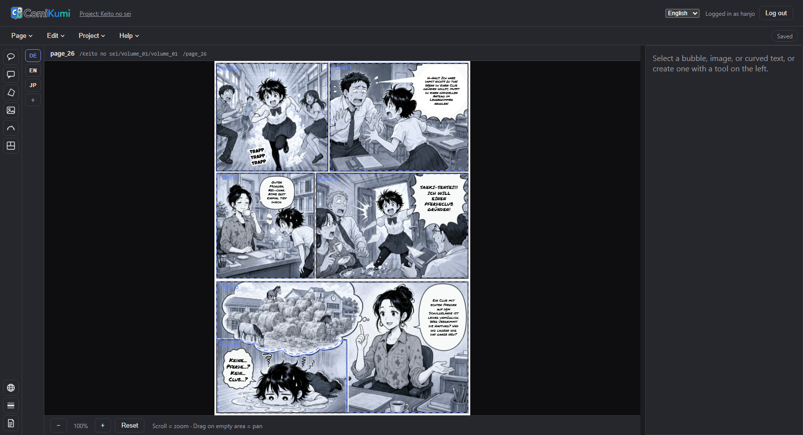

<p align="center">
  <picture>
    <source media="(prefers-color-scheme: dark)" srcset="docs/comikumi_logo_col_dark_h_tr.png">
    
  </picture>
</p>

<p align="center">A local-first lettering &amp; typesetting tool for manga/comic translation projects.</p>

<p align="center"><a href="https://discord.gg/DZ7nnaFzn">Join the Discord</a></p>

<p align="center">
  
</p>

---

ComiKumi is a desktop-style web app for placing and translating speech bubbles, curved
titles/SFX, and image patches directly on top of scanned comic pages, and exporting the
result as ready-to-publish PNGs. It runs entirely on your own machine — a small Express
server reads/writes files on disk (no cloud, no accounts, no telemetry), paired with a
React + Konva canvas editor.

## Highlights

- **Multi-language lettering** — every text/style field on a bubble can be overridden
  per language, or left to fall back to a shared base value; a page can carry as many
  languages as you configure.
- **Full vertical Japanese typesetting** (tategaki) — forced line breaks, both group-
  and mono-ruby furigana (`{漢字|かんじ}` or per-character `{東|とう}{京|きょう}`, the
  latter word-protected across column breaks), bōten emphasis dots (`{最悪*}`, the
  traditional alternative to bold/italic), automatic tate-chū-yoko for digit/Latin
  runs (fullwidth-normalized, so IME-typed "２１" is recognized too), and kinsoku
  shori line-breaking rules (see [screenshot](docs/screenshot/04_bubble_inspector_jp_tategaki.png)). Two toolbar buttons insert the furigana/bōten markup for you, with
  furigana pre-filled from the glossary when available. See [`docs/Japanese-Typesetting.md`](docs/Japanese-Typesetting.md).
- **Four element types**: speech bubbles (rect/oval/free perspective quad, with
  speech/thought/shout/custom-SVG backgrounds and configurable tails), placed images
  (perspective-warped into a quad), curved title/SFX text along a Bézier path, and
  panel-reference polygons for reporting.
- **Auto-Bubbles (detection + OCR)** — a toolbar tool finds speech-bubble regions on the
  page and reads the text inside them automatically, entirely client-side (WebGPU with
  a WASM fallback, no server round-trip). Every result goes through a review panel
  first — accept, edit, or reject each region before anything becomes a real bubble.
  Optimized for Japanese source text today; box detection alone still works for other
  languages. See [`docs/ocr-model-provenance.md`](docs/ocr-model-provenance.md) for the
  open-weight models used and their licenses.
- **Effect (SFX) bubbles** — a dedicated toolbar tool marks a bubble as a sound effect
  instead of dialogue (existing bubbles can be switched either way from the inspector);
  effect bubbles are excluded from "who says what" reports, auto-generated script
  dialogue lines, and the missing-translation QA check, while staying fully normal
  everywhere else (translation memory, reading order, the Layers navigator).
- **Layers/Panel navigator & bulk locking** — every bubble/image/curved text on a page,
  grouped by panel, with per-element lock toggles; "lock all panels", "lock panel +
  its bubbles", and "lock selection" bulk actions stop overlapping panels from getting
  in the way of clicking or accidentally dragging what's underneath.
- **Layer order (z-order)** — bring any bubble/image/curved text in front of or behind
  the others (Layers navigator buttons or the bubble context menu), e.g. to let an image
  patch sit in front of a bubble instead of always behind it. Respected in the editor,
  PNG export, and layered PSD export.
- **Bubble clipping & merging** — cut a bubble along a straight line (with a one-click
  suggestion from the nearest panel edge) so it sits flush against a panel border, or
  non-destructively merge several bubbles into one continuous outline with a single
  shared line of dialogue; ungrouping restores the original bubbles untouched. Text
  inset (the gap between outline and text) defaults to a sensible per-shape value but
  can be overridden per bubble or per preset with a 0–90% slider.
- **Balloon-aware line-breaking** — an opt-in, per-language toggle for oval bubbles
  derives each line's usable width from the bubble's true ellipse shape instead of one
  fixed inset rectangle, so lines near the middle can run wider and lines near the
  top/bottom narrower; works for both horizontal and vertical (tategaki) text,
  identically across the editor, PNG export, vector PDF, and PSD export.
- **Lettering presets** — define a reusable style ("SFX Style", "Narration", …) that
  live-updates every bubble/curved text linked to it, field by field, without
  overwriting values a preset doesn't define; a small built-in starter library ("Manga
  SFX", "Whisper", "Shout") can be added with one click.
- **Context view & glossary** — a reading-order-aware context sidebar (previous/current/
  next bubble, speaker + voice notes, panel crop; see [screenshot](docs/screenshot/05_editor_sidebar_context_view.png)) useful for lettering and writing just
  as much as translation, a project glossary with live highlighting in the text field
  and optional furigana readings, and "who says what" reports per page/volume.
- **Script planning** — a standalone, volume-wide script editor (plot, panel layout,
  image composition, and per-language dialogue, independent of the scanned page) plus
  an in-editor sidebar that links a script page to a real page (see [screenshot](docs/screenshot/05_editor_sidebar_script.png)) and inserts dialogue
  straight into the selected bubble. Either can be generated with one click from
  already-lettered pages instead of typed up from scratch.
- **AI assistant** — a chat panel in the page editor and script editor, backed by
  your own API key for OpenAI, Anthropic (Claude), Google (Gemini), or OpenRouter; a
  "Sign in with ChatGPT" Codex login; or a self-hosted Ollama server (per account,
  isolated credentials). Ask-only for now (no automatic edits to project data); each
  question is sent together with the current page's speech-bubble transcript and,
  where available, the page image itself.
- **Project-specific asset folders** — fonts, SVG bubble contours, and the image
  library can live in a shared global library, a per-project folder, or both (project
  wins on a filename collision).
- **Review & QC comments** — pins, box regions, or freehand marks anywhere on a page,
  with @-mentions of specific accounts or roles (and optional email notifications on
  mention) so feedback reaches the right person directly.
- **Read/Review viewer** — a dedicated, toolbar-free reading screen for QC passes: free
  zoom/pan, zoom-to-panel, reading-direction-aware page turning, a double-page spread
  view, and a side-by-side comparison of up to four arbitrary pages, with read-only
  access to characters/glossary/script in every project language.
- **PNG, print (CMYK TIFF), vector PDF/PSD, and CBZ export**, with page-range/language
  filtering, JSON import/export of a whole volume's layouts, and a full ComicInfo.xml
  metadata dialog (series/credits/publication/categorization/per-page type) for the CBZ.
- **Chapters** — tag pages into chapters (order always derived from the volume's own
  page order, never a separate thing to keep in sync); the page overview groups pages
  into chapter sections, the export dialog and Export-Viewer's ZIP/CBZ downloads gain a
  "just this chapter" filter, CBZ downloads get automatic chapter bookmarks (ComicInfo.xml,
  read by Komga/Kavita), and the volume report/QA checker gain chapter filtering/grouping.
- **Multi-user safety** — optimistic conflict detection on page saves (a save conflict
  prompts to keep your version or load the other one, instead of silently overwriting
  it), serialized writes for comments/script/project metadata, and a warning before
  switching the server's active project while someone else is still working in it.

Full feature list: [`docs/FEATURES.md`](docs/FEATURES.md) (also available
[in German](docs/FEATURES.de.md)). Layout JSON schema:
[`docs/JSON-Format.md`](docs/JSON-Format.md) (also available
[in German](docs/JSON-Format.de.md)). Script-planning JSON schema:
[`docs/Script-JSON-Format.md`](docs/Script-JSON-Format.md) (also available
[in German](docs/Script-JSON-Format.de.md)).

## Architecture

```
client/   React 19 + Konva 10 (react-konva) editor, Vite + Vitest
server/   Express 5 API — reads/writes project files, images, and layout JSON on disk
shared/   Zod schemas shared by both (layout, project, presets, characters, …)
docs/     Feature docs, JSON format reference, brand assets
```

No database — a project is a single `projekt.json` file (name, languages, characters,
glossary, presets, settings) plus your existing folder of scanned pages. The server
never needs its own persistent store beyond a small `server/data/` cache (fonts/images/
SVG library, page thumbnails, and a pointer to the last-opened project — all
regenerated on demand, safe to delete).

## Getting started

Requires Node.js 18+.

```bash
npm install
npm run dev
```

This installs both `client/` and `server/` (via `postinstall`) and starts them together
(server on `:3001`, client on `:5173`, proxied through Vite). Open the printed client URL,
then use **Project → Switch/create** to point the app at a folder of scanned pages — see
[`docs/FEATURES.md`](docs/FEATURES.md#projektverwaltung) for the expected folder
convention (a `<book>_empty` source-page folder per volume, `<book>_<language>` folders
for translated exports).

### Desktop app (no Node/browser needed at runtime)

`npm run electron:build` packages ComiKumi as a self-contained desktop app (Electron
embeds the same Express server and serves the built client from one process) —
`release/<platform>` gets a Windows NSIS installer, macOS `.dmg`, or Linux `.AppImage`
depending on the host OS. Project data goes to the OS's per-user app-data directory
instead of next to the install. No pre-built installer is published yet (build it
yourself from source); see [`electron/main.ts`](electron/main.ts) for how it wires the
embedded server together.

### Running client and server on separate hosts

By default the client talks to `http://localhost:3001` when unconfigured (matching the
dev setup above), or same-origin (`""`, relative paths) in a production build. To point a
built client at a server hosted elsewhere — a different machine, network, or port — set
`VITE_API_BASE_URL` (a Vite build-time env var, e.g. in `client/.env.local`) to that
server's absolute origin, no trailing slash:

```
VITE_API_BASE_URL=https://comikumi.example.com
```

The server already accepts cross-origin requests from anywhere (`cors()` with no
origin restriction in [`server/src/app.ts`](server/src/app.ts)) and every API route is
gated behind account login and per-project roles (viewer/translator/letterer/admin, plus
a server-wide system-admin bypass — see [Konten, Rollen & Zugriffsschutz](docs/FEATURES.md#konten-rollen--zugriffsschutz)).
The server does all of its file I/O (scan folders, project files, assets, thumbnails) on
its own local disk, so the actual scanned pages must live on (or be reachable from) the
machine the server runs on, not the client's.

### Scripts

| Command | Description |
|---|---|
| `npm run dev` | Start server + client together (hot reload) |
| `npm run build` | Type-check and build both packages for production |
| `npm run test` | Run the full test suite (server + client) |

Each package also has its own scripts (`npm --prefix client run <script>`, same for
`server`) — see their respective `package.json`.

### Tests

```bash
npm run test
```

Server tests include route-level integration tests (via `supertest`) that run against
temporary, isolated project/data directories — they never touch your real project data
or the repo's own `server/data/`. Client tests cover the pure geometry/typesetting/text
logic shared by the live canvas preview and the PNG export.

### E2E tests

A small Playwright suite in `e2e/` drives a real browser against real server + client
instances, covering the login screen, opening a project, editing a bubble (with a
reload to confirm it actually persisted), and exporting a page to PNG. One-time setup,
then run from the repo root:

```bash
npm --prefix e2e install
npx --prefix e2e playwright install chromium
npm run test:e2e
```

Every run spins up its own server (port 3101) and client (port 4173) against a
throwaway `LETTERING_DATA_DIR`/scan-root under `e2e/tmp-run/` — separate ports and data
from `npm run dev`, so the suite can run alongside a real dev session without
interfering with it. Not part of `npm run test` (browser download + runtime are too
heavy for the default test loop).

## Tech stack

React 19 · Konva 10 / react-konva · React Router 7 · Zustand · Zod 4 · Vite 8 · Vitest 4
— Express 5 · Sharp · Multer · Archiver · Nodemailer · Zod 4

## License

Free for Open Source, Indies, and Hobbyists.

ComiKumi is licensed under the [GNU Affero General Public License v3.0](LICENSE)
(AGPL-3.0-or-later). You're free to use, study, modify, and share it — including
running a modified version as a network service — as long as you make your source
changes available under the same license to anyone who interacts with it.
